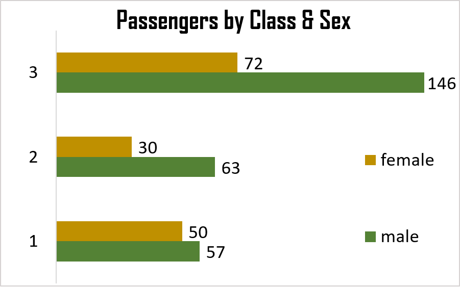
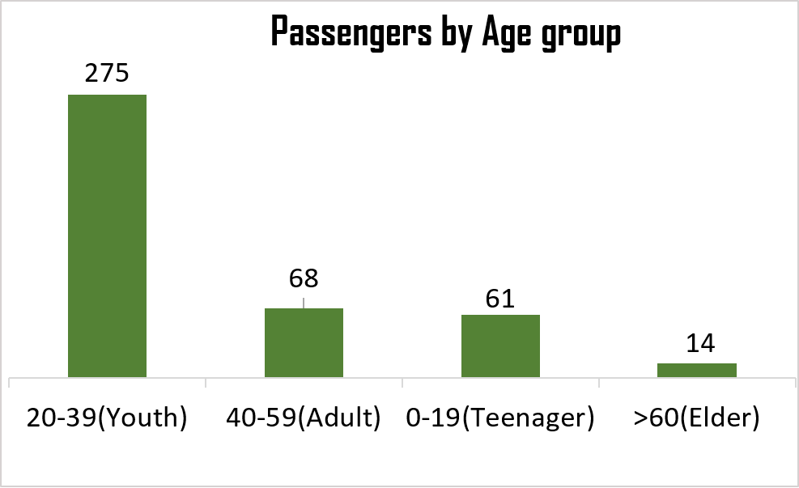
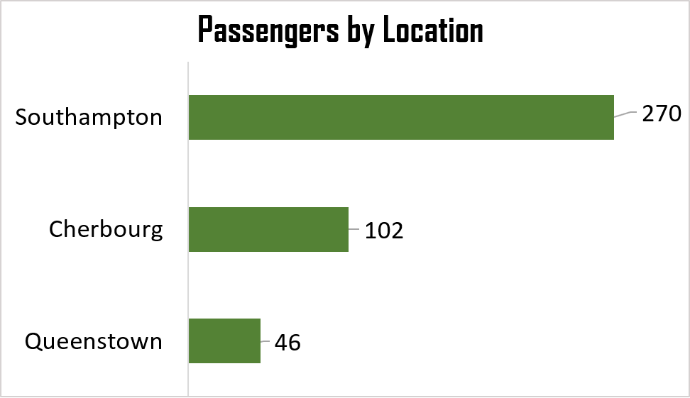
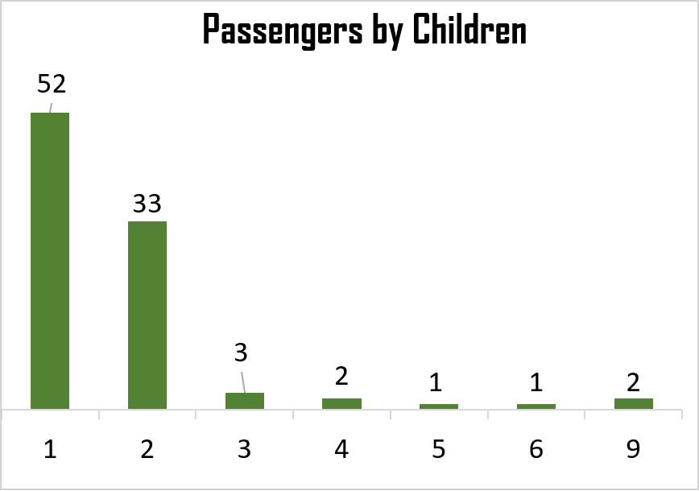
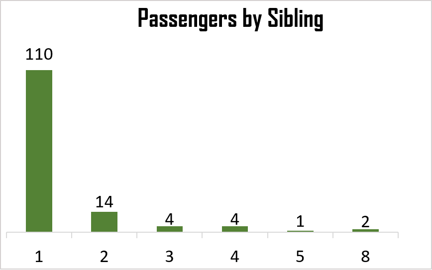
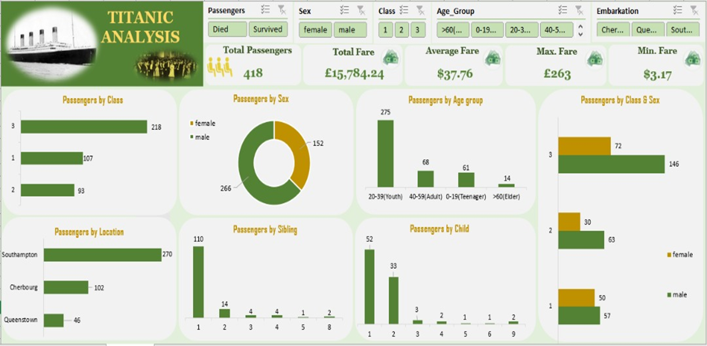
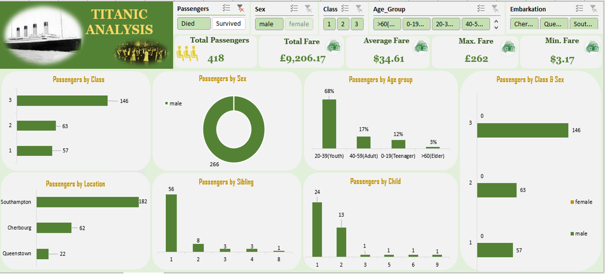
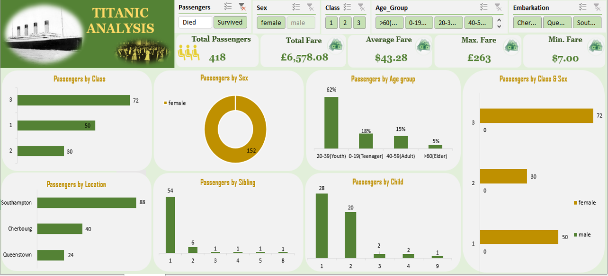

# **Titanic-Case-Study**

  ## Table of contents

 1. [Introduction](#Introduction) 

    - [Objective of the analysis](#Objective-of-the-analysis)
    - [Data cleaning](#Data-cleaning)

2.	[Exploratory Data Analysis](#Exploratory-Data-Analysis) 

    - [Passengers by class and sex](#Passeners-by-class-and-sex)
    - [Passengers by age group and embarked-location](#Passengers-by-age-group-and-embarked-location)
    - [Passengers by children and siblings](#Passengers-by-children-and-siblings)
    
3. [Overview Dashboard](#Overview-Dashboard)

4. [Tailored Data Analysis](Tailored-Data-Analysis)
 
    - [Survived passengers by sex and class](#Survived-passengers-by-sex-and-class)
    - [Survived passengers by age group and embarked location](#Survived-passengers-by-age-group-and-embarked-location) 
    - [Dead passengers dashboard](#Dead-passengers-dashboard)
    - [Survived passengers dashboard](#Survived-passengers-dashboard)
        
5. [Conclusion](#Conclusion)
---

## Introduction

Titanic was a British passenger liner, operated by the White Star Line, which sank in the North Atlantic Ocean on 15 April 1912 after striking an iceberg during her maiden voyage from Southampton, UK, to New York City. The collision with the iceberg ripped off many parts of the Titanic. Many classes of people of all ages and gender where present on that fateful night, but the bad luck was that there were only few life boats to rescue. The dead included a large number of men whose place was given to the many women and children on board. Of the estimated 2,224 passengers and crew aboard, more than 1,500 died, which made the sinking possibly one of the deadliest for a single ship up to that time. It remains to this day the deadliest peacetime sinking of a superliner or cruise ship. The disaster drew much public attention, provided foundational material for the disaster film genre, and has inspired many artistic works. 

### Objective of the analysis

Analysis of what happened on the titanic will be performed based on the dataset available, presenting which passengers survived or died at the time of sinking of the Titanic. The data analysis provides features like fare prices, class, sex, age group, siblings, child and location embarked which will be used to make exploratory and tailored analysis of what happened. The objective is to perform exploratory data analysis to the various information in the dataset available and to know effect of each field on survival of passengers with regards to there class, sex, age group and port of embarkation by applying analysis between every field of dataset with “Survival” and “Dead” field. The data analysis will be done on Microsoft excel.

### Data cleaning
Before applying any type of data analytics on the dataset, the data is first cleaned. There are some missing values in the 	dataset which needs to be handled. In attributes like Age and Cabin, missing values are replaced with the mean value of the existing age. Adding columns to calculate passenger age group, count number of male and female.

## Exploratory Data Analysis

We are going to perform exploratory data analysis in the first stage. In exploratory data analysis dataset is explored to give account of what happened. The data is deeply analyzed to find the total number of passengers that onboard the ship base on the dataset, and calculating the numbers of passengers with regard to each feature. 

According to the dataset, analysis shows that 418 passengers onboard the Titanic ship with The total fare prices of £15,784.24, £37.76 average fare prices, £263 maximum fare prices and £3.17 minimum fare prices respectively. And out of the 418 passengers that aboard the ship, 266 passengers died while 152 survived.

### Passengers by class and sex

class and sex               |  description
----------------------------------|------------------------------------------------------------------------------------
   |The analysis shows that 218 (~52%) passengers boarded the ship with 3rd class ticket of which 146 where males and 72 were females, 93(~22%) passengers boarded with 2nd class ticket of which 63 where males and 30 were female, while 107 (~26%) passengers boarded with 1st class ticket; 57 were males and 50 were females. In total, the data shows 266 passenger were male and 152 female that is; ~64% and 36% respectively. In other words, they were more male passengers than female.  

### Passengers by age group and embarked location

age group and location            |  description
----------------------------------|------------------------------------------------------------------------------------
       |  From the given data, I observed 332 registered ages missing. In order to capture all the registered ages, I manipulated the data using measure of Centre by filling the missing ages with the average age. From my analysis, they were more passengers between the ages of 20 to 39 years (~66%) and  lesser passengers that is; 14 (~3%) passengers are >60 years old. Passengers embarked on the ship from three (3) locations namely; Cherbourg, Queenstown and Southampton. 270 passengers went aboard the ship at port Southampton, 102 at port Queenstown and 46 at port Cherbourg. Southampton had the most passengers while Queenstown had the least passengers.
	
 
### Passengers by children and siblings

children and siblings               |  description
----------------------------------|------------------------------------------------------------------------------------
       |  The analysis on the dataset shows total of 94 passengers whose children aboard the ship. Of all the passengers who had children aboard the ship, ~55% (52) of them had a child aboard the ship. From my analysis on passengers with siblings, they were 135 passengers whose siblings aboard the ship of which ~81% (110) of them had one(1) siblings aboard the ship. 
 

## Overview dashboard

## TAILORED DATA ANALYSIS

The next stage is tailored data analysis. The analysis in this study aims to make comparative analysis of passengers between each feature to determine the feature which would influence the survival rate as well as the dead rate. 

### Survived passengers by sex and class

| class       | male                                  | female                     |
  | ------------------ | -------------------------------------------- | -------------------------- |
| 1st class           | 0                 | 50             |
|2nd class           | 0                                 | 30                |
| 3rd class            | 0                                 | 72         |

From the dataset, all the 152 females aboard the ship from all 3 classes survived from the sank ship; of which 50(33%) passengers were 1st class, 30(20%) passengers were of 2nd class and 72(47%) of the survived passengers were 3rd class, while none of the male passengers survived.
 
### Survived passengers by age group and embarked location

| age group | Cherbourg | Queenstown | Southampton | Total |
|-----------|-----------|------------|-------------|-------|
|   0-19    |     2     |     0      |      5      |    7  |
|   20-39   |     5     |     3      |     20      |   28  |
|   40-59   |    20     |    21      |     53      |   94  |
|   >60     |    13     |            |     10      |   23  |

 The analysis of survived passengers by their age group and embarked location shows that the passengers within the adult age (40-59years) has the highest total survival of 94 passengers, while the passengers within the teenager age (1-19years) has the lowest total survival of 7 passengers. No passenger within the age of 0-19 year survived in Queenstown, while no passenger within the age >60 embarked in Queenstown.  

### Dead passengers dashboard

### Survived passengers dashboard

## Conclusion

Data cleaning is the first step while performing data analysis. Exploratory data analytics in this context helps one to understand the dataset by showing the number of passengers in each features. EDA is used to figure out the total number of passengers that boarded the titanic ship based on class, sex, port of embarkation, passengers whose siblings aboard the ship and passengers whose children aboard the ship. Tailored data analytics in this study helps to give a simple comparison of passengers in each of the features in other to make predictions of how certain features could influence the survival rate and dead rate of the passengers. This is done by using graphical techniques.

By applying TDA some conclusions are drawn and facts are found. There is high influence of sex on survival. We can see from [Survived passengers by sex and class](#Survived-passengers-by-sex-and-class) that the number of survived passengers are the total number of female (152), while non of the 266 male passengers survived. With the high influence rate, we can say the female passengers are more likely to survive giving the 100 percent survival rate.

The influence of age on survival. From the table below, it shows how age could influence the possibility of survival. Given the total of 418 passengers that aboard the ship, 152 (~36) passengers survived the wrecked ship. Based on their age group, out of the 61 passengers within the teenager (0-19years) age bracket, 28 survived; out of the 275 passengers within the youth (20-39years) age bracket, 94 passengers survived; out of the 68 passengers within the adult (40-59years) age bracket, 23 survived; and lastly, out of the 14 passengers within the elders (>60 years) ages that boarded the ship, 7 survived the wrecked ship.

| age group | no. of passengers | survived | 
|-----------|-------------------|----------|
|    0-19   |      61           |    28    |  
|   20-39   |     275           |    94    |    
|   40-59   |      68           |    23    |      
|   >60     |      14           |     7    |    
| **Total** |   **418**         | **152**  |

With the above table we can say the passengers >60 years old with 50% survival rate is more likely to survive, followed by passengers between ages of 0-19years with survival rate of ~46%, while ages between 20-39years and 40-59years with the  survival rate of ~34% respectively, had less chance of survival.

